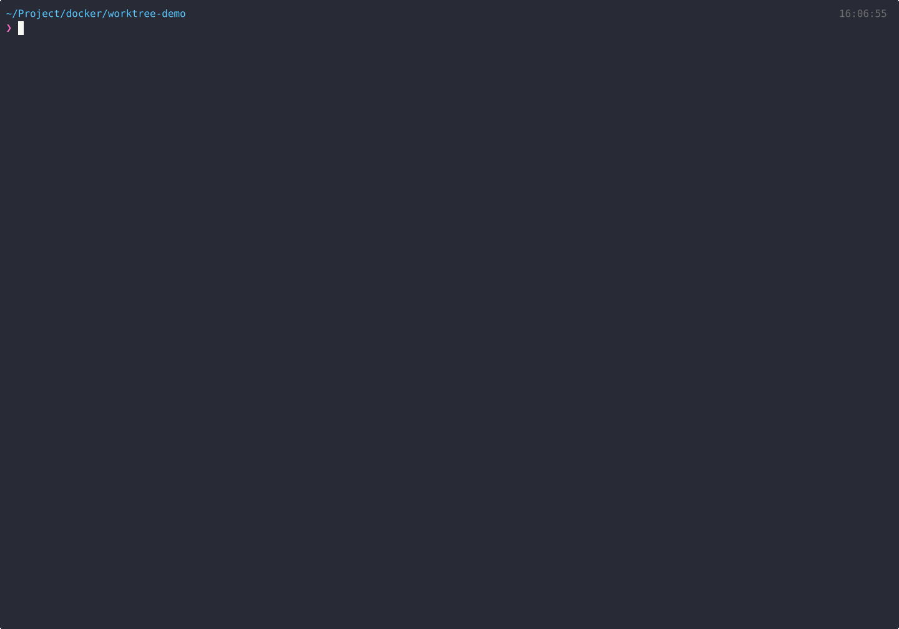

<div align="center">


# vLLM Compose

**Juggling multiple LLMs? Manage them all from one terminal.**

[](https://docs.docker.com/compose/)
[](https://github.com/vllm-project/vllm)
[](https://www.nvidia.com/)
[](LICENSE)

**English** | [한국어](README_KO.md)

---

Testing Qwen, switching to Llama, spinning up DeepSeek, tearing it down...
<br/>
**Each model needs its own config, its own container, and you have to remember it all.**
<br/><br/>
vLLM Compose saves per-model settings as profiles.
<br/>
**Just pick one in the TUI and hit Enter to spin it up or down.**

<br/>



</div>

<br/>

## Get Started in 30 Seconds

```bash
git clone https://github.com/Bae-ChangHyun/vllm-compose.git && cd vllm-compose

# Set HuggingFace token
cat > .env.common << 'EOF'
HF_TOKEN=your_token_here
HF_CACHE_PATH=/home/your-username/.cache/huggingface  # absolute path required
EOF

# Launch
uv sync
uv run vllm-compose
```

> Quick Setup auto-generates profile + config from just a model name.

<br/>

## Why vLLM Compose?

| | Manual | vLLM Compose |
|:---|:---|:---|
| **Switch models** | Repeat docker commands, re-enter configs | Select profile, press Enter |
| **Manage configs** | Remember long CLI args every time | Per-model YAML + Tab autocomplete |
| **Multi-model** | Edit compose files by hand | Independent profiles, run simultaneously |
| **Monitor status** | Repeat docker ps, nvidia-smi | Real-time dashboard |
| **Version selection** | Track image tags manually | Latest / Official / Nightly picker with version-tagged pulls |

<br/>

## Core Features

**TUI** &mdash; Textual-only interface for start, stop, logs, and config management

**Profiles** &mdash; Save per-model settings independently, switch instantly

**Config** &mdash; Manage vLLM params as YAML, Tab autocomplete auto-extracted from your local vLLM image

**GPU Monitor** &mdash; Real-time GPU usage bar on dashboard, auto-refresh every 5s

**Memory Estimator** &mdash; Estimate GPU memory before deploying via [hf-mem](https://github.com/alvarobartt/hf-mem), with per-GPU progress bar

**Source Build** &mdash; Auto GPU detection Fast Build (10-30 min) from the TUI

**LoRA** &mdash; Multi-adapter loading with conditional path mapping when enabled

<br/>

---

<details>
<summary><b>TUI Keyboard Shortcuts</b></summary>

<br/>

| Key | Action |
|:---|:---|
| `Enter` | Profile action menu (start/stop/logs/edit/delete) |
| `w` | Quick Setup |
| `n` | New profile |
| `m` | Memory estimator (focus search bar) |
| `s` | System info |
| `c` | Configs |
| `u` / `d` / `l` | Start / Stop / Logs (selected profile) |
| `?` | Full shortcut help |

</details>

<details>
<summary><b>Profile & Config Structure</b></summary>

<br/>

```yaml
# config/my-model.yaml — vLLM serving config
model: Qwen/Qwen3-30B
gpu-memory-utilization: 0.9
max-model-len: 32768
enable-auto-tool-choice: true   # boolean flags: empty value → auto true
```

```bash
# profiles/my-model.env — Container settings
CONTAINER_NAME=my-model
VLLM_PORT=8000
CONFIG_NAME=my-model
GPU_ID=0
TENSOR_PARALLEL_SIZE=1
ENABLE_LORA=false
MODEL_ID=Qwen/Qwen3-30B   # optional, used to auto-create a default config
```

</details>

<details>
<summary><b>Source Build</b></summary>

<br/>

```bash
# Start the TUI
uv run vllm-compose
```

Then open a profile, choose `Dev Build`, and start it.

vLLM Compose will:
- clone or update the vLLM source tree
- build a `vllm-dev:<branch>` image for your current GPU
- start the selected profile with that dev image

Set `VLLM_BRANCH` in `.env.common` to choose the default source branch.

You can also override the repository URL and branch directly from the Dev Build screen to build from your own fork.

</details>

<details>
<summary><b>LoRA Adapters</b></summary>

<br/>

```bash
# .env.common
LORA_BASE_PATH=/home/user/lora-adapters

# profiles/mymodel.env
ENABLE_LORA=true
MAX_LORAS=2
LORA_MODULES=ko=/app/lora/ko_adapter,en=/app/lora/en_adapter
```

```python
response = client.chat.completions.create(
    model="ko",  # LoRA adapter name
    messages=[...]
)
```

> LoRA mount is added only when `ENABLE_LORA=true`.

</details>

<details>
<summary><b>Troubleshooting</b></summary>

<br/>

| Problem | Solution |
|:---|:---|
| Container won't start | Open the profile in TUI and inspect logs |
| API should stay local-only | Default bind is `127.0.0.1:${VLLM_PORT}`; put it behind a proxy if remote access is needed |
| GPU OOM | Set `gpu-memory-utilization: 0.7` or `TENSOR_PARALLEL_SIZE=2` |
| Port conflict | Change `VLLM_PORT`, then retry from the TUI |
| Tokenizer error on distilled models | Add `tokenizer: OriginalOrg/OriginalModel` in config YAML |
| Need extra Python packages | Set `EXTRA_PIP_PACKAGES` in the profile and pin versions carefully |
| Add vLLM args | Write any CLI arg as YAML in `config/*.yaml` |
| Copy logs in TUI | Shift+drag to select, Ctrl+C to copy ([details](https://textual.textualize.io/FAQ/#how-can-i-select-and-copy-text-in-a-textual-app)) |

</details>

---

## Requirements

- Docker with [NVIDIA Container Toolkit](https://docs.nvidia.com/datacenter/cloud-native/container-toolkit/install-guide.html)
- Python 3.10+ (for TUI)
- [uv](https://docs.astral.sh/uv/)
- NVIDIA GPU(s)

---

## Roadmap

- [ ] **Model-specific recommended configs** — Curated vLLM configs per model family (Llama, Qwen, DeepSeek, Gemma, etc.) with vendor-recommended settings for `max-model-len`, `quantization`, `rope-scaling`, and more
- [ ] **Config presets / templates** — Select from ready-made configs during Quick Setup based on model size and GPU capacity
- [ ] **.env.common setup wizard** — Interactive first-run setup for HF token and cache path
- [ ] **API connectivity test** — Quick `/v1/models` call to verify the model is serving
- [ ] **Profile clone** — Duplicate a profile with one click for A/B testing configs
- [ ] **Batch operations** — Start/stop multiple containers at once
- [ ] **Export/Import** — Share profile + config bundles across servers
- [ ] **Web UI** — Optional browser-based dashboard for team access

---

<div align="center">

**MIT License**

</div>
