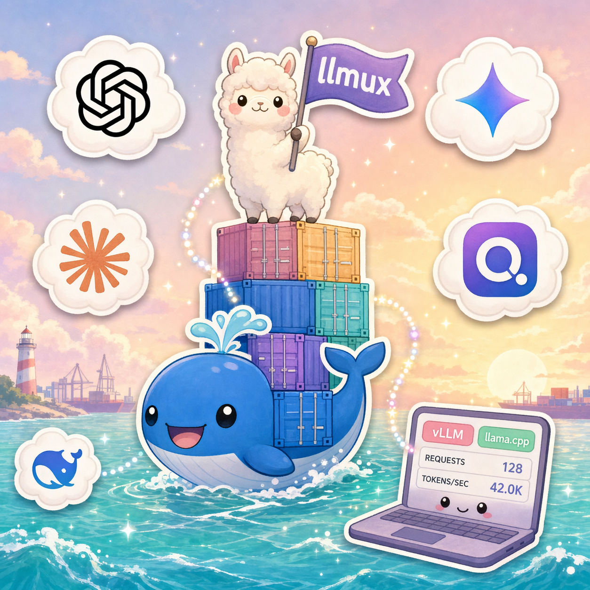
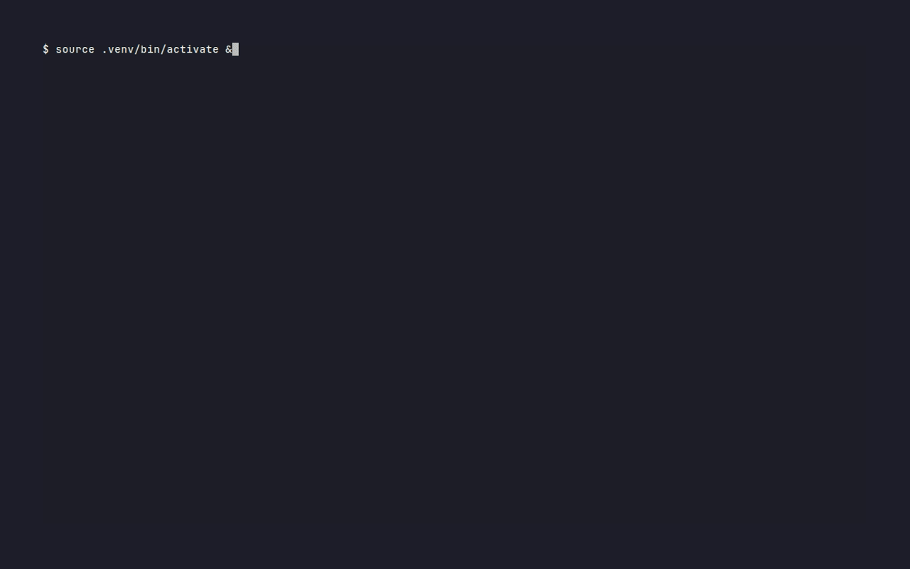
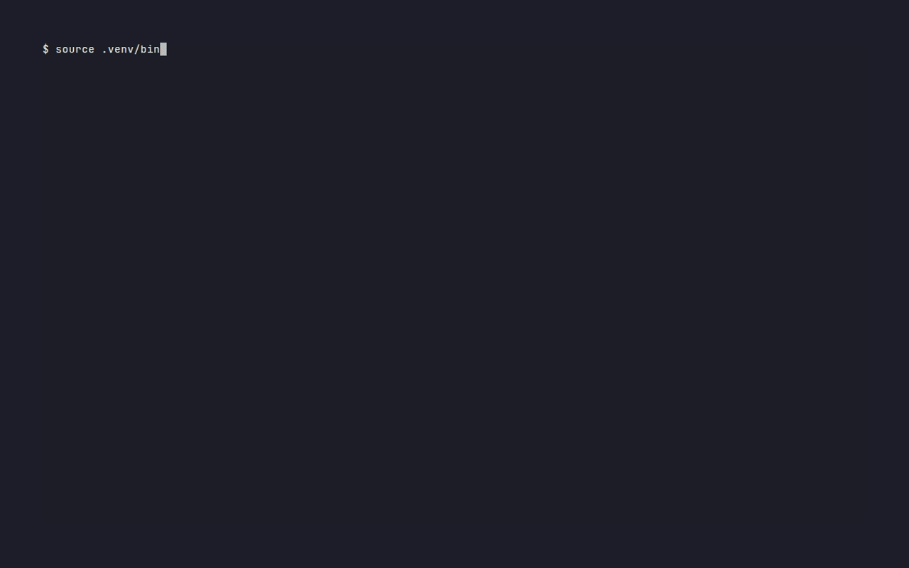

<div align="center">



# llmux

**One TUI. Two backends. Zero config headaches.**

[](https://docs.docker.com/compose/)
[](https://github.com/vllm-project/vllm)
[](https://github.com/ggerganov/llama.cpp)
[](https://www.nvidia.com/)
[](LICENSE)

vLLM for HF Transformers. llama.cpp for GGUF.
<br/>
**Two different toolchains, two different configs, two different terminals.**
<br/><br/>
llmux unifies both under a single Textual dashboard backed by Docker Compose.
<br/>
**Pick a profile, press Enter &mdash; whichever engine it belongs to just runs.**

</div>

<br/>

## Demos

<div align="center">

<table>
<tr>
<td align="center" width="50%">
  <b>llama.cpp</b> &mdash; Quick Setup → edit config → start → stream logs<br/>
  
</td>
<td align="center" width="50%">
  <b>vLLM</b> &mdash; Quick Setup → tune GPU mem → Local Latest → APIServer logs<br/>
  
</td>
</tr>
<tr>
<td align="center" colspan="2">
  <b>GPU memory estimator</b> &mdash; per-GPU fit bar across models + system view<br/>
  
</td>
</tr>
</table>

</div>

Each demo above is a checked-in `.tape` script under [`demo/`](demo/) &mdash; re-render them yourself with [`vhs`](https://github.com/charmbracelet/vhs).

<br/>

## Quick Start

```bash
git clone https://github.com/Bae-ChangHyun/llmux.git && cd llmux

# 1. Shared HF token + model dirs
cp .env.common.example .env.common
$EDITOR .env.common       # set HF_TOKEN, HF_CACHE_PATH, MODEL_DIR

# 2. Profiles (start from the template, edit in place)
cp profiles.example.yaml profiles.yaml
$EDITOR profiles.yaml

# 3. Launch the TUI
uv sync
uv run llmux
```

From the dashboard:

- `n` &nbsp;Create a new profile via **Quick Setup** (backend picker → HF repo → auto-generated config)
- `Enter` &nbsp;Action menu on the selected profile (start / logs / edit / bench / delete)
- `u` / `d` / `l` &nbsp;Start / Stop / Logs for the selected profile
- `c` / `e` &nbsp;Edit config / profile **directly in the TUI** — no shell editing required
- `m` &nbsp;Memory estimator &middot; `s` &nbsp;System info &middot; `r` &nbsp;Refresh &middot; `q` &nbsp;Quit

<br/>

## Why llmux?

|  | Manual, two toolchains | llmux |
|:---|:---|:---|
| **Switch engines** | Different CLI, compose, and TUI per engine | One Textual dashboard for both |
| **Profile format** | `.env` per profile, scattered across two repos | Single `profiles.yaml`, YAML-native, renders to `.env` at launch |
| **Port / GPU clash** | Find out when the container crashes | Pre-start conflict gate across both backends |
| **Image versioning** | `docker pull latest` and hope | Refuses `:latest`; resolves to semver + verifies in-container version |
| **Benchmarking** | `curl` the endpoint, eyeball timing | Built-in `/v1/chat/completions` bench, identical protocol for both |
| **Memory sizing** | Guess and hope it fits | [`hf-mem`](https://github.com/alvarobartt/hf-mem) integration with per-GPU fit bars |
| **GGUF setup** | `hf download` → edit compose → mount | Auto-download on first start, paths resolved by profile |

<br/>

## Features

- **Unified Textual TUI** &mdash; Every vLLM and llama.cpp profile side-by-side in a single `DataTable`.
- **YAML-native profiles** &mdash; One `profiles.yaml`, `defaults` block for inheritance, rendered to `.env` only at launch.
- **Safe vLLM image resolution** &mdash; Version picker skips `:latest`/`:nightly` aliases; post-start verification warns on tag/content mismatch.
- **Cross-backend conflict gate** &mdash; Port/GPU overlap is checked before start, with explicit warning + confirm flow.
- **Quick Setup** &mdash; HF model or repo → profile + config auto-generated, with live memory estimate.
- **OpenAI-compatible bench** &mdash; Same `/v1/chat/completions` latency/throughput shot for either engine.
- **GGUF auto-download** &mdash; llama.cpp profiles fetch the file on first start, no manual `hf download`.
- **Deterministic demos** &mdash; Every GIF in this README is a checked-in VHS `.tape`.

<br/>

---

## Documentation

<details>
<summary><b>Profile format (<code>profiles.yaml</code>)</b></summary>

<br/>

Single source of truth for both backends. Any field omitted falls back to `defaults.<backend>`.

```yaml
# profiles.yaml
version: 1

defaults:
  vllm: { port: 8000, gpu_id: "0", tensor_parallel_size: 1, enable_lora: false }
  llamacpp: { port: 8080, gpu_id: "0" }

profiles:
  - name: qwen3-0-6b
    backend: vllm
    config_name: qwen3-0-6b       # → config/vllm/qwen3-0-6b.yaml
    model_id: Qwen/Qwen3-0.6B
    # enable_lora: true
    # extra_pip_packages: flash-attn==2.7.4.post1
    # env_vars:
    #   VLLM_USE_FLASHINFER_MOE_MXFP4_MXFP8: "1"

  - name: gemma-3-4b
    backend: llamacpp
    config_name: gemma-3-4b       # → config/llamacpp/gemma-3-4b.yaml
    model_file: gemma-3-4b-it-q4_k_m.gguf
    hf_repo: unsloth/gemma-3-4b-it-GGUF
    hf_file: gemma-3-4b-it-q4_k_m.gguf
```

At start time, each selected profile is rendered to `.runtime/<backend>/<name>.env` and passed via `docker compose --env-file`. You never hand-write `.env` files; `profiles.yaml` is the whole interface. Runtime renders are gitignored.

</details>

<details>
<summary><b>Per-model serving configs</b></summary>

<br/>

Profile → launcher settings. Config → per-model engine flags.

```
config/vllm/<name>.yaml        # vLLM serving config (passed as CLI args to vllm serve)
config/llamacpp/<name>.yaml    # llama-server flags (rendered via scripts/llamacpp/render-override.py)
```

```yaml
# config/vllm/qwen3-0-6b.yaml
model: Qwen/Qwen3-0.6B
gpu-memory-utilization: 0.9
max-model-len: 32768

# config/llamacpp/gemma-3-4b.yaml
n-gpu-layers: 99
ctx-size: 16384
parallel: 4
```

Use `c` on the dashboard to edit these directly in the TUI — inputs auto-complete against the real `--help` flag list.

</details>

<details>
<summary><b>Keyboard reference</b></summary>

<br/>

| Key | Action |
|:---|:---|
| `Enter` | Action menu on the selected profile (start / stop / logs / bench / edit / delete) |
| `n` | New profile — opens Quick Setup via the backend picker |
| `m` | HF model memory estimator (type a model, Enter to run) |
| `s` | System info (GPU, images, disk, model dir) |
| `r` | Refresh the dashboard |
| `q` | Quit |
| `u` / `d` / `l` | Start / Stop / Logs for the selected profile |
| `e` / `c` / `x` | Edit profile / Edit config / Delete profile |
| `?` | Full shortcut cheatsheet inside the app |
| `f` | Toggle auto-follow in log/start streaming screens |

</details>

<details>
<summary><b>Cross-backend conflict gate</b></summary>

<br/>

Starting a profile runs a pre-flight check against every other profile — *both* backends — for:

- **Port overlap** &mdash; including non-llmux Docker containers already holding the port.
- **GPU overlap** &mdash; any profile with an intersecting `gpu_id` that's currently running.

If a conflict exists, you get a warning modal with details and can decide whether to continue.

For vLLM, a runtime host-process bind check still runs before `compose up`; choosing **Start anyway** only bypasses the pre-flight conflict gate after explicit confirmation.

If Docker port probing is unavailable, llmux shows a warning and keeps the runtime port check enabled.

</details>

<details>
<summary><b>vLLM image version policy</b></summary>

<br/>

llmux **refuses to start from `vllm/vllm-openai:latest`**. The `:latest` alias is a moving target — its contents change whenever upstream pushes, but the local tag name doesn't, so "what version is actually running" becomes unknowable. Every version picker resolves to a semver tag before pulling.

| Picker option | Resolves to | Pulls? |
|:---|:---|:---|
| **Local Latest** | highest `vX.Y.Z` tag you have locally | no — existing image only |
| **Official Release** | DockerHub's current stable release, e.g. `v0.19.1` | `--pull always` on that explicit version |
| **Nightly** | `vllm/vllm-openai:nightly` | `--pull always` (intentionally rolling; no versioned alternative) |
| **Custom Tag** | whatever you type, except `latest` (rejected) | default compose behavior |
| **Dev Build** | local `vllm-dev:<tag>` from a git source tree | built in-place |

After the container is up, llmux asks the container itself (`import vllm; print(vllm.__version__)`) and warns in the log panel if the result doesn't match the tag you picked — catches cases where someone ran `docker tag` manually.

**Rule of thumb**: if you ever need to type a pull command yourself, use an explicit version: `docker pull vllm/vllm-openai:v0.19.1`. Never `docker pull vllm/vllm-openai` or `:latest`.

</details>

<details>
<summary><b>Troubleshooting</b></summary>

<br/>

| Problem | Solution |
|:---|:---|
| Container won't start | Open the profile in TUI and inspect logs |
| GPU OOM (vLLM) | Lower `gpu-memory-utilization` or raise `tensor_parallel_size` in the profile |
| GPU OOM (llama.cpp) | Lower `n-gpu-layers` in config YAML |
| Port conflict | TUI warns pre-start; change the profile's `port` in `profiles.yaml` |
| Port conflict with no matching Docker container | Another local process may already bind that port; change profile `port` or stop the process |
| `Local Latest` shows "no images" | You only have `:latest` or `:nightly` locally. Run `docker pull vllm/vllm-openai:vX.Y.Z` (pick a specific version) and retry |
| GGUF download stuck | Check `HF_TOKEN` in `.env.common`; retry from TUI &mdash; `switch.sh` auto-invokes `pull-model.sh` on start |
| Copy logs in TUI | Shift+drag to select, Ctrl+C to copy ([Textual FAQ](https://textual.textualize.io/FAQ/#how-can-i-select-and-copy-text-in-a-textual-app)) |

</details>

<br/>

## Requirements

- Docker with [NVIDIA Container Toolkit](https://docs.nvidia.com/datacenter/cloud-native/container-toolkit/install-guide.html)
- NVIDIA GPU(s)
- Python 3.10+
- [uv](https://docs.astral.sh/uv/) for the TUI venv

<br/>

## Roadmap

- [ ] **Recipe-based config recommender** &mdash; Auto-generate `config/vllm/<name>.yaml` from [recipes.vllm.ai](https://recipes.vllm.ai/) given a HF model ID + target GPU
- [ ] **Profile clone across backends** &mdash; Duplicate a vLLM profile as its llama.cpp GGUF equivalent for quick A/B testing
- [ ] **Batch operations** &mdash; Start/stop multiple profiles across both backends at once
- [ ] **Export/Import bundles** &mdash; Share full profile + config sets between machines
- [ ] **Quantization recommender** &mdash; Suggest `Q4_K_M` vs `Q8_0` based on target GPU + memory estimator
- [ ] **Web UI** &mdash; Optional browser-based dashboard for remote access
- [ ] **Model-specific presets** &mdash; Curated configs per family (Llama, Qwen, DeepSeek) for both engines

<br/>

## Credits

llmux evolved from and unifies two earlier projects by the same author, now superseded:

- `vllm-compose` &mdash; vLLM profiles (this repo's predecessor; renamed to `llmux`)
- `llamacpp-compose` &mdash; llama.cpp profiles (merged in)

---

<div align="center">

**MIT License**

</div>
