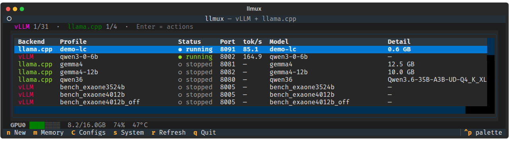
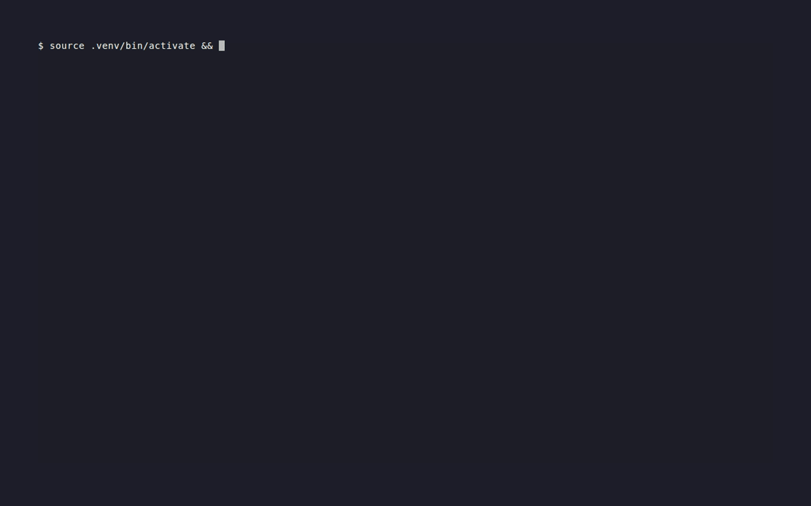
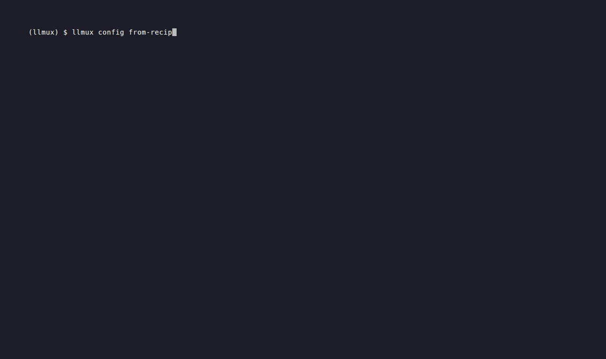

<div align="center">


# llmux

**Run and manage vLLM and llama.cpp servers from one terminal — TUI or CLI.**

[](https://github.com/Bae-ChangHyun/llmux/actions/workflows/ci.yml)
[](https://Bae-ChangHyun.github.io/llmux/)
[](https://docs.docker.com/compose/)
[](https://github.com/vllm-project/vllm)
[](https://github.com/ggml-org/llama.cpp)
[](https://www.nvidia.com/)
[](LICENSE)

vLLM for HF Transformers. llama.cpp for GGUF.
<br/>
**Two different toolchains, two different configs, two different terminals.**
<br/><br/>
llmux unifies both under a single Textual dashboard backed by Docker Compose.
<br/>
**Pick a profile, press Enter &mdash; whichever engine it belongs to just runs.**

<br/>

<sub>Linux · NVIDIA GPU · Docker. No macOS, AMD/ROCm, or CPU-only yet.</sub>

<br/>

**[📖 Full documentation →](https://Bae-ChangHyun.github.io/llmux/)**

</div>

<br/>

## Demos

<div align="center">

<b>Both engines on one GPU, live tok/s per model</b> &mdash; a vLLM model and a llama.cpp model running side by side, each with its own throughput, all in one dashboard<br/>


<br/><br/>

<b>One dashboard for vLLM + llama.cpp</b> &mdash; toggle a config flag on/off, add one with autocomplete, then import a model from its official vLLM recipe &mdash; reviewed against your GPU's VRAM<br/>


<br/><br/>

<table>
<tr>
<td align="center" width="50%">
  <b>Headless CLI</b> &mdash; recipe import, parameter on/off, status<br/>
  
</td>
<td align="center" width="50%">
  <b>GPU memory estimator</b> &mdash; per-GPU fit bar across models<br/>
  
</td>
</tr>
</table>

</div>

<br/>

## Features

- **One dashboard for both engines** &mdash; Every vLLM and llama.cpp profile side-by-side in a single Textual TUI, with a live **tok/s** column per running model.
- **Build a profile once, spin it up and down** &mdash; Keep every model you're experimenting with as a named profile in one `profiles.yaml`. No re-writing config each time — pick one, hit Enter, and it launches the right engine; stop it and start another just as fast.
- **VRAM-aware vLLM recipe import** &mdash; Pull a model's official [vllm-project/recipes](https://github.com/vllm-project/recipes) config, then review its precision variants (bf16 / fp8 / awq) against your actual GPU's VRAM before it's written &mdash; so a recipe verified on an 80 GB card doesn't silently overshoot a 16 GB one.
- **Memory estimator** &mdash; Point it at an HF model and get a per-GPU fit bar ([`hf-mem`](https://github.com/alvarobartt/hf-mem)) before you download or launch anything.
- **Every engine flag, 1:1** &mdash; `config/<backend>/<name>.yaml` maps directly to engine flags — sampling, context length, KV-cache precision, MoE CPU offload. Toggle any flag **on/off without deleting it**, and your hand-written comments survive edits.
- **Flag autocomplete from your actual image** &mdash; The config editor completes flag names from the real `vllm serve` / `llama-server` flag set of the image you're running (extracted once and cached per version), so suggestions match the engine build you actually launch.
- **Live throughput + benchmarks** &mdash; Real-time generation tok/s from each container's `/metrics` (`llmux stats`), plus a warmup + median benchmark (`llmux bench`) to compare quant A against quant B on the same hardware.
- **Dev builds from source** &mdash; Build a `vllm-dev:` / `llamacpp-dev:` image from any fork/branch (GPU arch auto-detected) and pin a profile to it via `image_tag`.
- **Everything scriptable** &mdash; Every TUI action is also a headless `llmux` subcommand with `--json` output, built for scripts, agents, and CI.
- **Rename in place** &mdash; Rename a profile or config without rebuilding; profiles pointing at a renamed config are repointed automatically.
- **Safe vLLM image resolution** &mdash; Refuses the ambiguous `:latest`, resolves stable picks to a specific version, and verifies the version actually running inside the container.
- **Bilingual UI** &mdash; The whole TUI switches between Korean and English with `LLMUX_LANG=ko|en`.

<br/>

## Quick Start

Install with one command — it clones llmux, installs dependencies (and `uv`
itself if missing), and puts the `llmux` command on your PATH:

```bash
curl -fsSL https://raw.githubusercontent.com/Bae-ChangHyun/llmux/main/install.sh | sh
```

Then just launch it — the first run walks you through a short setup wizard
(HF cache directory, model directory, optional token) and writes `.env.common`
for you:

```bash
llmux
```

The checkout stays a live git repo, so `git pull` in `~/.llmux` applies updates
with no reinstall — and llmux checks GitHub for a newer release on startup
(once a day) and offers to pull it for you. Install elsewhere by passing
`LLMUX_DIR` to the script: `curl -fsSL ... | LLMUX_DIR=/path sh`.

<details>
<summary>Manual install</summary>

```bash
git clone https://github.com/Bae-ChangHyun/llmux.git && cd llmux
uv tool install --editable .   # editable — code edits are picked up live
uv tool update-shell           # one-time: adds ~/.local/bin to PATH
```

</details>

> Prefer not to install globally? `uv run llmux` works from inside the repo. From
> elsewhere, set `LLMUX_ROOT=/path/to/llmux`.

> **Language:** the TUI is bilingual (English / Korean). It follows your system
> locale by default; force one with `LLMUX_LANG=en` or `LLMUX_LANG=ko`.

See the [Installation guide](https://Bae-ChangHyun.github.io/llmux/getting-started/installation.html)
and [Quick Start](https://Bae-ChangHyun.github.io/llmux/getting-started/quickstart.html) for the full walkthrough.

### Headless CLI

Every TUI feature is also a non-interactive subcommand — `llmux` with no arguments
launches the TUI, any subcommand bypasses it:

```bash
llmux up <profile>                 # start a container
llmux logs <profile>               # follow logs
llmux ps --json --running          # machine-readable status, both backends
llmux stats --once --json          # live tok/s from every running container
llmux bench <profile> --runs 3     # warmup + median tok/s benchmark
llmux profile quick-setup Qwen/Qwen3-8B --gpu-id 0,1
llmux config edit <name> --disable trust-remote-code   # toggle a flag off, keep it
llmux config from-recipe Qwen/Qwen3-32B --variant fp8   # official vLLM recipe
llmux profile rename old-name new-name                  # container must be stopped
llmux image build-dev --backend llamacpp --branch master
```

`--json` is supported by every list/show/check command. Full command/flag list in the
[CLI Reference](https://Bae-ChangHyun.github.io/llmux/reference/cli.html).

<br/>

## Documentation

Full docs live at **[Bae-ChangHyun.github.io/llmux](https://Bae-ChangHyun.github.io/llmux/)**:

| Section | What's there |
|:---|:---|
| [Getting Started](https://Bae-ChangHyun.github.io/llmux/getting-started/installation.html) | Installation, first-model walkthrough (TUI + CLI) |
| [Guide](https://Bae-ChangHyun.github.io/llmux/guide/profiles.html) | Profiles, model configs, container lifecycle, TUI shortcuts, dev builds |
| [Backends](https://Bae-ChangHyun.github.io/llmux/backends/comparison.html) | vLLM and llama.cpp deep-dives + a feature comparison matrix |
| [Reference](https://Bae-ChangHyun.github.io/llmux/reference/cli.html) | Every CLI command/flag, `.env.common` variables, internal architecture |
| [Troubleshooting](https://Bae-ChangHyun.github.io/llmux/troubleshooting.html) | Common start/download/GPU issues — symptom → cause → fix |

<br/>

## Why llmux?

|  | Manual, two toolchains | llmux |
|:---|:---|:---|
| **Switch engines** | Different CLI, compose, and TUI per engine | One Textual dashboard for both |
| **Profile format** | `.env` per profile, scattered across two repos | Single `profiles.yaml`, YAML-native, renders to `.env` at launch |
| **Port / GPU clash** | Find out when the container crashes | Pre-start conflict gate across both backends |
| **Image versioning** | `docker pull latest` and hope | Refuses `:latest`; resolves to semver + verifies in-container version |
| **Dev builds** | Clone, build, wire compose by hand | `llmux image build-dev` from any branch; pin per profile |
| **Memory sizing** | Guess and hope it fits | [`hf-mem`](https://github.com/alvarobartt/hf-mem) integration with per-GPU fit bars |
| **GGUF setup** | `hf download` → edit compose → mount | llama.cpp downloads on first start, cached on the host |

**What llmux is not.** It doesn't proxy or route inference requests — each profile serves on its own port, and llmux is the layer that starts, stops, builds, and benchmarks them. If you want request-level model swapping behind a single endpoint, that's what [llama-swap](https://github.com/mostlygeek/llama-swap) does. It's also not a chat UI — point [Open WebUI](https://github.com/open-webui/open-webui) or any OpenAI-compatible client at the servers it launches.

<br/>

## Requirements

- Linux with NVIDIA GPU(s) + a recent driver
- [Docker Engine](https://docs.docker.com/engine/install/) + the [NVIDIA Container Toolkit](https://docs.nvidia.com/datacenter/cloud-native/container-toolkit/install-guide.html) (for GPU passthrough)
- Python 3.10+, and [uv](https://docs.astral.sh/uv/) for the TUI environment

Confirm GPU passthrough works before the first run:

```bash
docker run --rm --gpus all ubuntu nvidia-smi
```

> macOS, AMD/ROCm, and CPU-only aren't supported yet — llmux drives CUDA images through NVIDIA GPU passthrough, which needs an NVIDIA GPU on Linux.

<br/>

## Roadmap

- [x] **Recipe-based config recommender** &mdash; Shipped in v2.4.0 as `llmux config from-recipe`
- [ ] **Profile clone across backends** &mdash; `llmux profile clone` duplicates within a backend today; cloning a vLLM profile as its llama.cpp GGUF equivalent is still open
- [ ] **Batch operations** &mdash; Start/stop multiple profiles across both backends at once
- [ ] **Export/Import bundles** &mdash; Share full profile + config sets between machines
- [ ] **AMD / ROCm** &mdash; Mostly a base-image + device-mount swap; more feasible than macOS
- [ ] **macOS (native Metal)** &mdash; Under consideration, and llama.cpp only: Docker can't pass an Apple GPU into a Linux container, so this would mean running llama.cpp as a native process instead of a container (vLLM stays CUDA-only)
- [ ] **Web UI** &mdash; Optional browser-based dashboard for remote access

<br/>

## Built on

llmux is a control layer — the hard parts are upstream. It runs the official, unmodified images and stands on:

- [vLLM](https://github.com/vllm-project/vllm) and [llama.cpp](https://github.com/ggml-org/llama.cpp) — the inference engines it drives
- [vllm-project/recipes](https://github.com/vllm-project/recipes) — source of the imported vLLM configs
- [hf-mem](https://github.com/alvarobartt/hf-mem) — the model memory estimator
- [Textual](https://github.com/Textualize/textual) and [Typer](https://github.com/fastapi/typer) — the TUI and CLI

<br/>

<div align="center">

**MIT License**

</div>
