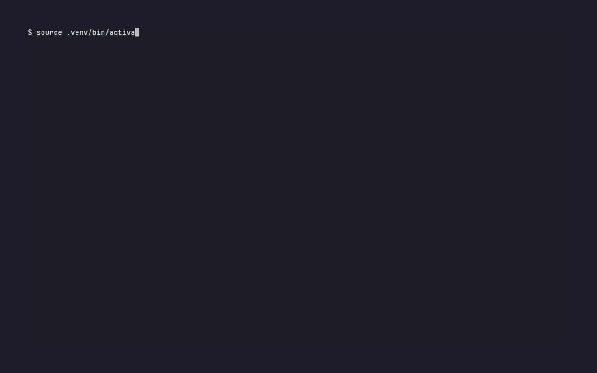
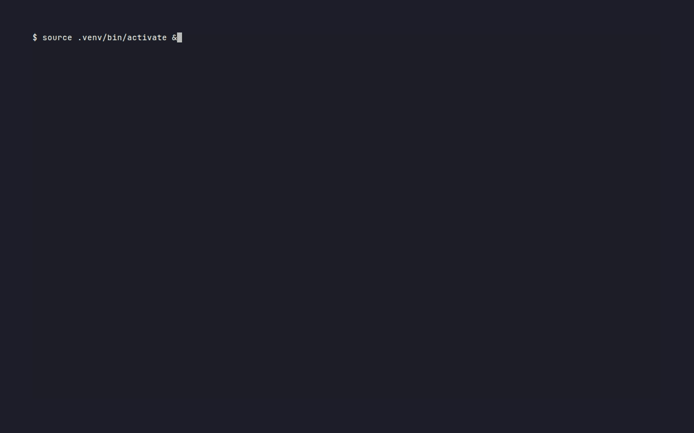

<div align="center">


# llmux

**One TUI. Two backends. Zero config headaches.**

[](https://Bae-ChangHyun.github.io/llmux/)
[](https://docs.docker.com/compose/)
[](https://github.com/vllm-project/vllm)
[](https://github.com/ggml-org/llama.cpp)
[](https://www.nvidia.com/)
[](LICENSE)

vLLM for HF Transformers. llama.cpp for GGUF.
<br/>
**Two different toolchains, two different configs, two different terminals.**
<br/><br/>
llmux unifies both under a single Textual dashboard backed by Docker Compose.
<br/>
**Pick a profile, press Enter &mdash; whichever engine it belongs to just runs.**

<br/>

**[📖 Full documentation →](https://Bae-ChangHyun.github.io/llmux/)**

</div>

<br/>

## Demos

<div align="center">

<table>
<tr>
<td align="center" width="50%">
  <b>llama.cpp</b> &mdash; Quick Setup → edit config → start → stream logs<br/>
  
</td>
<td align="center" width="50%">
  <b>vLLM</b> &mdash; Quick Setup → tune GPU mem → Local Latest → APIServer logs<br/>
  
</td>
</tr>
<tr>
<td align="center" colspan="2">
  <b>GPU memory estimator</b> &mdash; per-GPU fit bar across models + system view<br/>
  
</td>
</tr>
</table>

</div>

<br/>

## Features

- **Unified Textual TUI** &mdash; Every vLLM and llama.cpp profile side-by-side in a single dashboard.
- **TUI ⇄ CLI parity** &mdash; Every TUI action is also a headless subcommand, built for scripts, agents, and CI.
- **YAML-native profiles** &mdash; One `profiles.yaml`, `defaults` block for inheritance, rendered to `.env` only at launch.
- **Per-model configs** &mdash; `config/<backend>/<name>.yaml` maps 1:1 to engine flags — sampling, context length, KV-cache precision, MoE CPU offload.
- **Dev builds from source** &mdash; Build a `vllm-dev:` / `llamacpp-dev:` image from any fork/branch (GPU arch auto-detected) and pin a profile to it via `image_tag`.
- **Cross-backend conflict gate** &mdash; Port/GPU overlap is checked before start, across *both* backends.
- **Safe vLLM image resolution** &mdash; Refuses `:latest`, resolves stable picks to semver, verifies the in-container version.
- **Quick Setup + memory estimator** &mdash; HF model → profile + config auto-generated, with a per-GPU [`hf-mem`](https://github.com/alvarobartt/hf-mem) fit bar.

<br/>

## Quick Start

Install with one command — it clones llmux, installs dependencies (and `uv`
itself if missing), and puts the `llmux` command on your PATH:

```bash
curl -fsSL https://raw.githubusercontent.com/Bae-ChangHyun/llmux/main/install.sh | sh
```

Then configure and launch:

```bash
cd ~/.llmux

# 1. Shared HF token + model/cache dirs
cp .env.common.example .env.common
$EDITOR .env.common       # set HF_TOKEN, HF_CACHE_PATH, MODEL_DIR

# 2. Profiles (start from the template, edit in place)
cp profiles.example.yaml profiles.yaml
$EDITOR profiles.yaml

# 3. Launch the TUI from anywhere
llmux
```

The checkout stays a live git repo, so `git pull` in `~/.llmux` applies updates
with no reinstall. Install elsewhere with `LLMUX_DIR=/path curl ... | sh`.

<details>
<summary>Manual install</summary>

```bash
git clone https://github.com/Bae-ChangHyun/llmux.git && cd llmux
uv tool install --editable .   # editable — code edits are picked up live
uv tool update-shell           # one-time: adds ~/.local/bin to PATH
```

</details>

> Prefer not to install globally? `uv run llmux` works from inside the repo. From
> elsewhere, set `LLMUX_ROOT=/path/to/llmux`.

See the [Installation guide](https://Bae-ChangHyun.github.io/llmux/getting-started/installation/)
and [Quick Start](https://Bae-ChangHyun.github.io/llmux/getting-started/quickstart/) for the full walkthrough.

### Headless CLI

Every TUI feature is also a non-interactive subcommand — `llmux` with no arguments
launches the TUI, any subcommand bypasses it:

```bash
llmux up <profile>                 # start a container
llmux logs <profile>               # follow logs
llmux ps --json --running          # machine-readable status, both backends
llmux profile quick-setup Qwen/Qwen3-8B --gpu-id 0,1
llmux image build-dev --backend llamacpp --branch master
```

`--json` is supported by every list/show/check command. Full command/flag list in the
[CLI Reference](https://Bae-ChangHyun.github.io/llmux/reference/cli/).

<br/>

## Documentation

Full docs live at **[Bae-ChangHyun.github.io/llmux](https://Bae-ChangHyun.github.io/llmux/)**:

| Section | What's there |
|:---|:---|
| [Getting Started](https://Bae-ChangHyun.github.io/llmux/getting-started/installation/) | Installation, first-model walkthrough (TUI + CLI) |
| [Guide](https://Bae-ChangHyun.github.io/llmux/guide/profiles/) | Profiles, model configs, container lifecycle, TUI shortcuts, dev builds |
| [Backends](https://Bae-ChangHyun.github.io/llmux/backends/comparison/) | vLLM and llama.cpp deep-dives + a feature comparison matrix |
| [Reference](https://Bae-ChangHyun.github.io/llmux/reference/cli/) | Every CLI command/flag, `.env.common` variables, internal architecture |
| [Troubleshooting](https://Bae-ChangHyun.github.io/llmux/troubleshooting/) | Common start/download/GPU issues — symptom → cause → fix |

<br/>

## Why llmux?

|  | Manual, two toolchains | llmux |
|:---|:---|:---|
| **Switch engines** | Different CLI, compose, and TUI per engine | One Textual dashboard for both |
| **Profile format** | `.env` per profile, scattered across two repos | Single `profiles.yaml`, YAML-native, renders to `.env` at launch |
| **Port / GPU clash** | Find out when the container crashes | Pre-start conflict gate across both backends |
| **Image versioning** | `docker pull latest` and hope | Refuses `:latest`; resolves to semver + verifies in-container version |
| **Dev builds** | Clone, build, wire compose by hand | `llmux image build-dev` from any branch; pin per profile |
| **Memory sizing** | Guess and hope it fits | [`hf-mem`](https://github.com/alvarobartt/hf-mem) integration with per-GPU fit bars |
| **GGUF setup** | `hf download` → edit compose → mount | llama.cpp downloads on first start, cached on the host |

<br/>

## Requirements

- Linux with NVIDIA GPU(s) + a recent driver
- Docker with the [NVIDIA Container Toolkit](https://docs.nvidia.com/datacenter/cloud-native/container-toolkit/install-guide.html)
- Python 3.10+
- [uv](https://docs.astral.sh/uv/) for the TUI environment

<br/>

## Roadmap

- [ ] **Recipe-based config recommender** &mdash; Auto-generate `config/vllm/<name>.yaml` from [recipes.vllm.ai](https://recipes.vllm.ai/) given a HF model ID + target GPU
- [ ] **Profile clone across backends** &mdash; Duplicate a vLLM profile as its llama.cpp GGUF equivalent for quick A/B testing
- [ ] **Batch operations** &mdash; Start/stop multiple profiles across both backends at once
- [ ] **Export/Import bundles** &mdash; Share full profile + config sets between machines
- [ ] **Web UI** &mdash; Optional browser-based dashboard for remote access

<br/>

## Credits

llmux evolved from and unifies two earlier projects by the same author, now superseded:

- `vllm-compose` &mdash; vLLM profiles (this repo's predecessor; renamed to `llmux`)
- `llamacpp-compose` &mdash; llama.cpp profiles (merged in)

---

<div align="center">

**MIT License**

</div>
