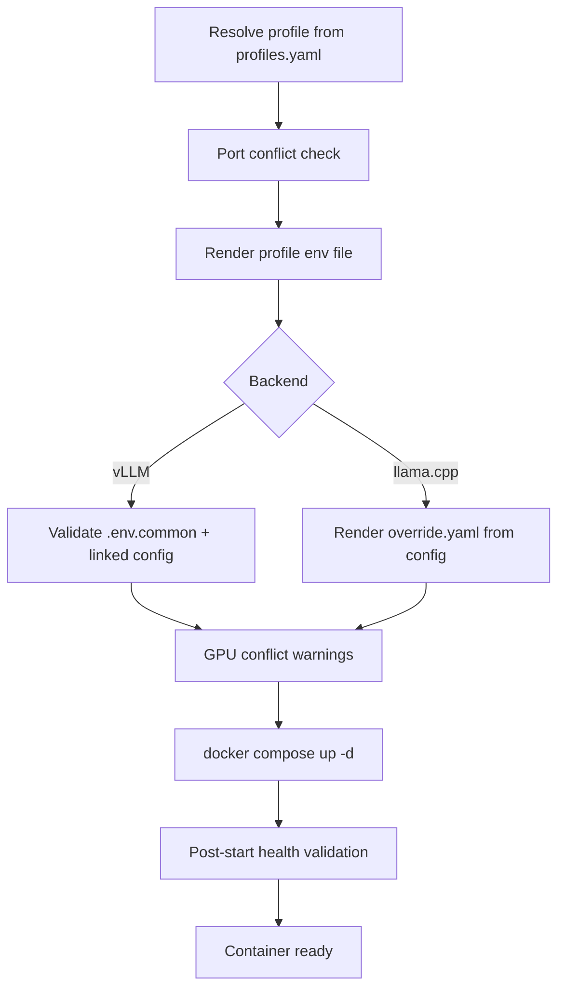

# Container Lifecycle

llmux drives every container through `docker compose`, but you never write
compose commands by hand. The four lifecycle operations — **up**, **down**,
**logs**, **ps** — are exposed identically through the [TUI](tui.md) and the
headless CLI. This page describes what happens under the hood.

## Startup flow

Starting a profile is more than `docker compose up`. llmux runs an ordered
pipeline and aborts early with a clear message if any step fails.



### 1. Profile env render

The profile is read from `profiles.yaml` and rendered to
`.runtime/<backend>/<name>.env`. This file is what `docker compose --env-file`
consumes — it carries `CONTAINER_NAME`, the port, `GPU_ID`, `CONFIG_NAME`, and
backend-specific values. It is regenerated on every start, so editing it
directly is pointless; edit [the profile](profiles.md) instead.

### 2. Config / override render

=== "vLLM"

    llmux validates `.env.common` (checks `HF_CACHE_PATH` is set and absolute,
    plus `LORA_BASE_PATH` when LoRA is enabled) and ensures the linked
    [config](configs.md) has a usable `model:`. If the profile has a `model_id`
    but no config, llmux scaffolds one automatically. The `config/vllm/`
    directory is mounted into the container at `/config/`.

=== "llama.cpp"

    `scripts/llamacpp/render-override.py` reads `config/llamacpp/<config>.yaml`
    and the profile's GGUF metadata, then writes
    `.runtime/llamacpp/override-<profile>.yaml` containing the `llama-server`
    `command:` block. The per-profile override file lets multiple llama.cpp
    profiles run concurrently without clobbering each other.

### 3. Conflict gates

Before `compose up`, llmux checks for resource clashes:

- **Port conflicts** — the target port is probed against running Docker
  containers *and* local processes (a raw socket bind). A static overlap
  between two *stopped* profiles is ignored.
- **GPU conflicts** — the profile's `gpu_id` set is compared against every
  *running* container from **both** backends. Overlap produces a warning.

In the CLI, port conflicts are hard errors. In the TUI, the cross-backend
conflict gate surfaces port + GPU clashes in a confirmation dialog so you can
**Start anyway** or cancel.

### 4. compose up + health validation

llmux runs `docker compose ... up -d` with the rendered env files. After
compose returns, a post-start validation loop polls `docker inspect`:

- If the container is `restarting` / `exited` / `dead` or becomes `unhealthy`,
  startup is reported as **failed** and the last log lines are printed (this
  catches e.g. a GPU OOM during engine init).
- Otherwise llmux waits for the model endpoint to respond — `/v1/models` for
  vLLM, `/health` for llama.cpp. If the model is still loading when the timeout
  hits, you get a warning, not a failure.

## The lifecycle commands

All commands auto-detect the backend from the profile name; pass `--backend` /
`-b` to disambiguate when a name exists in both. These are top-level CLI
aliases — `llmux up` is shorthand for `llmux container up`.

### `up` — start a profile

```bash
llmux up qwen3-0-6b
llmux up qwen3-0-6b --backend vllm

# image overrides
llmux up qwen3-0-6b --tag v0.20.1          # specific vllm/vllm-openai tag
llmux up qwen3-0-6b --tag v0.20.1 --pull   # force --pull always (vLLM only)
llmux up qwen3-0-6b --dev                  # use the locally-built dev image
llmux up gemma-3-4b --tag llamacpp-dev:master
```

| Option | Description |
| --- | --- |
| `--backend`, `-b` | Force the backend instead of auto-detecting. |
| `--tag`, `-t` | Image tag override. Empty = highest local versioned tag (vLLM) or the profile/compose default (llama.cpp). |
| `--dev` | Use the locally-built `<backend>-dev:<tag>` image; builds it on demand if missing. See [Dev Builds](dev-build.md). |
| `--pull` | vLLM only: force `--pull always`. Ignored for llama.cpp. |
| `--repo-url` / `--branch` | Dev image source overrides (defaults from `.env.common`). |

Compose output streams to stdout. The command exits non-zero if startup fails.

!!! warning "vLLM rejects `:latest`"
    The `:latest` alias doesn't describe an image's real contents, so llmux
    refuses it. Pick a specific version, `nightly`, the resolved
    "Official Release" tag, or your highest local versioned tag.

### `down` — stop a profile

```bash
llmux down qwen3-0-6b
```

llmux prefers `docker compose down` for a clean network teardown. If the
container is orphaned (no override file, or compose down fails), it falls back
to `docker stop` + `docker rm` (`docker rm -f` for llama.cpp). Stopping an
already-stopped profile is a no-op that exits 0.

### `logs` — stream container logs

```bash
llmux logs qwen3-0-6b              # follow (default), last 200 lines first
llmux logs qwen3-0-6b --no-follow  # print recent lines and exit
llmux logs qwen3-0-6b --tail 500   # change the initial backlog
```

| Option | Description |
| --- | --- |
| `--tail`, `-n` | Number of recent lines to show before following (default 200). |
| `--follow / --no-follow`, `-f / -F` | Follow output (default) or print-and-exit. |

While following, `Ctrl-C` stops the stream (exit code 130).

### `ps` — list profiles and status

```bash
llmux ps                    # all profiles, both backends
llmux ps --backend vllm     # one backend only
llmux ps --running          # only running containers
llmux ps --json             # machine-readable output
```

Output columns: `backend`, `profile`, `status`, `port`, `gpu`, `container`,
`model`. Status is derived from `docker ps` health state — `healthy`,
`unhealthy`, `starting`, `running`, `exited`, or `stopped`.

### `render-env` — regenerate runtime env files

```bash
llmux render-env qwen3-0-6b   # one profile
llmux render-env              # re-render every profile
llmux render-env --backend llamacpp
```

Useful after hand-editing `profiles.yaml`, or to inspect exactly what compose
will see. `up` does this automatically — you rarely need it directly.

## Healthchecks

Both compose definitions declare a Docker `healthcheck` that curls the
in-container `/health` endpoint every 30s. The `start_period` is generous to
allow for model loading — **600s for vLLM**, **300s for llama.cpp** — so a slow
first load won't be flagged as unhealthy. `ps` and the TUI dashboard read this
health state to show `healthy` / `starting` / `unhealthy`.

## See also

- [Profiles](profiles.md) — the launch recipe `up` resolves
- [Model Configs](configs.md) — what gets rendered into the container at startup
- [Using the TUI](tui.md) — the same lifecycle, driven interactively
- [Dev Builds](dev-build.md) — the `--dev` image path
