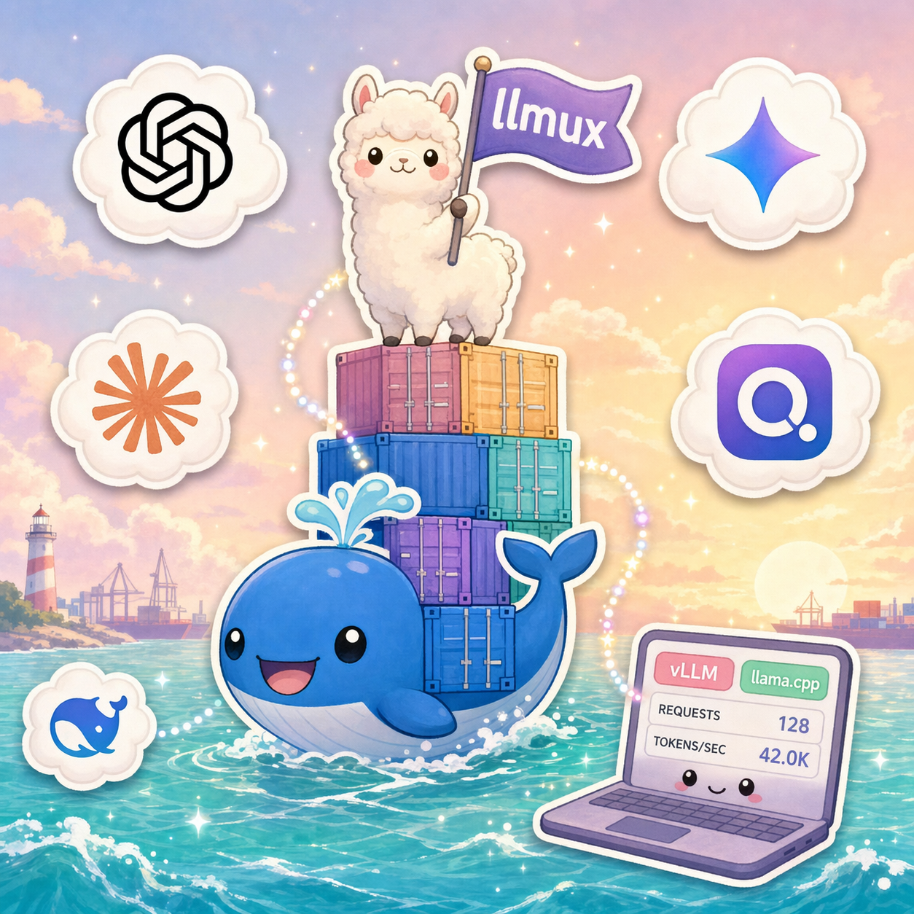

<div align="center" markdown>

{ width="420" }

# llmux

**One TUI. Two backends. Zero config headaches.**

A terminal multiplexer for LLM servers — drive [vLLM](https://github.com/vllm-project/vllm)
and [llama.cpp](https://github.com/ggml-org/llama.cpp) from a single Textual TUI
or a fully scriptable headless CLI.

[Get Started](getting-started/installation.md){ .md-button .md-button--primary }
[CLI Reference](reference/cli.md){ .md-button }

</div>

---

## What is llmux?

llmux unifies two very different LLM serving stacks behind one interface:

- **vLLM** — high-throughput serving for Hugging Face Transformers models, with
  tensor parallelism and LoRA.
- **llama.cpp** — GGUF inference with CPU/GPU offload, MoE expert offload, and
  speculative decoding.

Instead of juggling two sets of `docker compose` files, env vars, and CLI flags,
you define **profiles** in a single `profiles.yaml`, and llmux renders, launches,
and monitors the containers for you — from a dashboard TUI or from shell scripts.

```text
profiles.yaml ──▶ llmux ──▶ docker compose ──▶ vLLM / llama.cpp container
                   │
                   ├── TUI dashboard (start / stop / logs / benchmark)
                   └── headless CLI (scripts, agents, CI)
```

## Highlights

<div class="grid cards" markdown>

-   :material-view-dashboard: **Unified dashboard**

    Every vLLM and llama.cpp profile in one table — status, port, model, GPU —
    with cross-backend port/GPU conflict detection before you start.

-   :material-console: **TUI ⇄ CLI parity**

    Anything you can do in the TUI you can do headless: `llmux up`, `llmux profile
    edit`, `llmux image build-dev`, … Built for scripts, agents, and CI.

-   :material-hammer-wrench: **Dev builds from source**

    Build a `vllm-dev:` or `llamacpp-dev:` image straight from any fork/branch —
    GPU arch auto-detected — and pin a single profile to it via `image_tag`.

-   :material-tune: **Per-model configs**

    `config/<backend>/<name>.yaml` maps 1:1 to engine flags. Sampling, context
    length, KV-cache precision, MoE CPU offload — all version-controlled.

</div>

## Pick your path

| You want to… | Go to |
|---|---|
| Install llmux and serve your first model | [Installation](getting-started/installation.md) → [Quick Start](getting-started/quickstart.md) |
| Understand `profiles.yaml` and model configs | [Profiles](guide/profiles.md) · [Model Configs](guide/configs.md) |
| Learn the dashboard and keyboard shortcuts | [Using the TUI](guide/tui.md) |
| Build an image from an unmerged PR branch | [Dev Builds](guide/dev-build.md) |
| Compare vLLM vs llama.cpp capabilities | [Backend Comparison](backends/comparison.md) |
| Look up every command and flag | [CLI Reference](reference/cli.md) |
| Fix a broken start / download / GPU issue | [Troubleshooting](troubleshooting.md) |

## Requirements

- Linux with an NVIDIA GPU + recent driver
- Docker with the NVIDIA Container Toolkit
- Python 3.10+ (managed via [uv](https://docs.astral.sh/uv/))

See [Installation](getting-started/installation.md) for the full setup.
