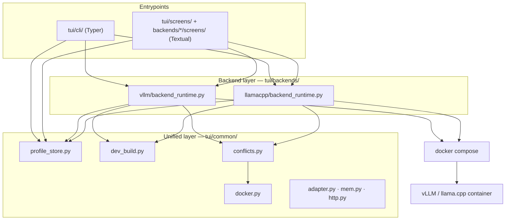
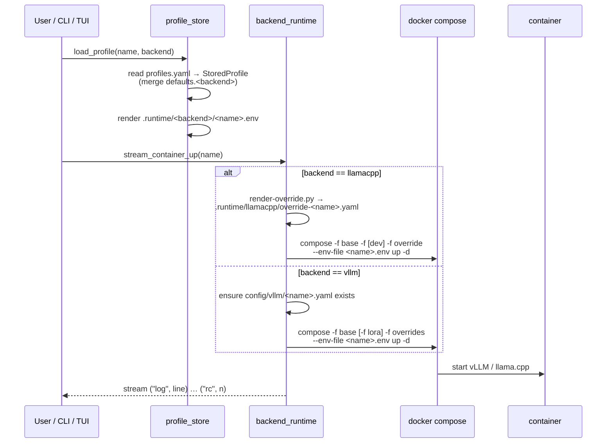

# Architecture

This page describes how llmux is structured internally: the package layout,
the unified-vs-backend split, and the end-to-end flow from `profiles.yaml` to a
running container. It is aimed at contributors and at anyone debugging why a
profile started (or didn't).

## Design in one sentence

llmux keeps **one source of truth** (`profiles.yaml`), renders it into
backend-specific runtime artifacts, and hands those to `docker compose` — so
the same dashboard and the same CLI drive two very different engines
(vLLM and llama.cpp) without the user ever editing Compose files.

## Repository layout

```text
llmux/
├── tui/
│   ├── __main__.py            # python -m tui → tui.app:main
│   ├── app.py                 # LlmuxApp (Textual) + main() → dispatches to CLI
│   ├── cli/                   # headless Typer CLI
│   │   ├── __init__.py        # Typer root app + sub-apps + top-level aliases
│   │   ├── _runtime.py        # backend detection, async glue, table/JSON output
│   │   ├── _launch_tui.py     # isolated TUI launcher (keeps textual out of CLI imports)
│   │   ├── container.py       # up / down / logs / ps / render-env
│   │   ├── profile.py         # profile list/show/new/edit/delete/quick-setup
│   │   ├── config.py          # config list/show/new/edit/delete
│   │   ├── image.py           # image list/pull/build-dev
│   │   └── system.py          # system gpu/mem-estimate/env-check
│   ├── common/                # backend-agnostic unified layer
│   │   ├── profile_store.py   # profiles.yaml ⇄ StoredProfile, .runtime/*.env renderer
│   │   ├── dev_build.py       # DevBuildSpec + shared clone/build/label pipeline
│   │   ├── docker.py          # nvidia-smi + docker ps helpers, GPU-id parsing
│   │   ├── conflicts.py       # cross-backend port / GPU conflict detection
│   │   ├── mem.py             # hf-mem VRAM estimation, .env file parsing
│   │   ├── http.py            # OpenAI-compatible /v1 probe + benchmark helpers
│   │   ├── adapter.py         # DashboardRow — unified read-only row snapshot
│   │   ├── widgets.py         # shared Textual modals (confirm, backend picker)
│   │   └── app.tcss           # shared Textual stylesheet
│   ├── backends/
│   │   ├── vllm/              # vLLM-specific layer
│   │   │   ├── backend_common.py    # paths, Profile/Config/ContainerStatus dataclasses
│   │   │   ├── backend.py           # facade re-exporting the vLLM API
│   │   │   ├── backend_storage.py   # vLLM profile/config CRUD
│   │   │   ├── backend_runtime.py   # compose orchestration, dev build, status
│   │   │   ├── backend_process.py   # subprocess run/stream helpers
│   │   │   ├── backend_inspect.py   # local + DockerHub image inspection
│   │   │   ├── adapter.py           # VllmAdapter → DashboardRow
│   │   │   └── screens/             # vLLM TUI screens
│   │   └── llamacpp/          # llama.cpp-specific layer
│   │       ├── backend.py           # paths, Profile/Config, CRUD, log streaming
│   │       ├── backend_runtime.py   # compose orchestration, dev build, status
│   │       ├── adapter.py           # LlamacppAdapter → DashboardRow
│   │       └── screens/             # llama.cpp TUI screens
│   └── screens/
│       └── dashboard.py       # unified DashboardScreen (both backends in one table)
├── compose/
│   ├── vllm/                  # docker-compose.yaml + .dev / .lora / .overrides
│   └── llamacpp/              # docker-compose.yaml + .dev
├── config/
│   ├── vllm/<name>.yaml       # vLLM serve flags per model
│   └── llamacpp/<name>.yaml   # llama-server flags per model
├── scripts/
│   ├── vllm/entrypoint-wrapper.sh
│   └── llamacpp/
│       ├── render-override.py        # profile + config → per-profile compose override
│       └── legacy/                   # archived shell scripts (superseded by Python)
├── profiles.yaml              # single source of truth (gitignored)
├── .env.common                # host-wide settings (gitignored)
└── .runtime/                  # auto-rendered, gitignored
    ├── vllm/<name>.env
    └── llamacpp/<name>.env + override-<name>.yaml
```

## The unified layer vs. the backend layers

llmux is split into two tiers so that everything cross-cutting is written
once:

| Tier | Lives in | Responsibility |
|---|---|---|
| **Unified layer** | `tui/common/` | Anything identical for both backends: profile storage, the dev-build pipeline, GPU/port conflict checks, Docker/`nvidia-smi` helpers, the `DashboardRow` contract. |
| **Backend layer** | `tui/backends/{vllm,llamacpp}/` | Engine-specific knowledge: which Compose files to layer, how to build the engine command, image inspection, status parsing — exposed mostly through each backend's `backend_runtime.py`. |
| **Entrypoints** | `tui/cli/`, `tui/screens/`, `tui/backends/*/screens/` | The Typer CLI and the Textual TUI. Both call into the same unified + backend functions. |

The dashboard never special-cases a backend at the data level: each backend's
`adapter.py` produces a list of `DashboardRow` snapshots, and
`tui/screens/dashboard.py` merges, sorts (running rows float to the top), and
renders them in one `DataTable`.



## Launch flow: from `profiles.yaml` to a running container

`profiles.yaml` is the only file you edit by hand (or via `llmux profile …`).
Everything under `.runtime/` is generated. The flow differs slightly per
backend because the engines consume their config differently.



### Step 1 — `profiles.yaml` → `StoredProfile`

`tui/common/profile_store.py` reads `profiles.yaml`, merges each entry over
`defaults.<backend>` (and the built-in `DEFAULTS`), and yields a
`StoredProfile` dataclass — a *superset* record where fields that don't apply
to a backend simply stay at their defaults.

### Step 2 — `StoredProfile` → `.runtime/<backend>/<name>.env`

`profile_store.render_env()` writes a shell-quoted env file that
`docker compose --env-file` consumes. The rendered keys differ by backend:

- **vLLM**: `CONTAINER_NAME`, `VLLM_PORT`, `GPU_ID`, `TENSOR_PARALLEL_SIZE`,
  `CONFIG_NAME`, `MODEL_ID`, `ENABLE_LORA`, plus optional `MAX_LORAS`,
  `MAX_LORA_RANK`, `LORA_MODULES`, `EXTRA_PIP_PACKAGES`, and any `env_vars`.
- **llama.cpp**: `CONTAINER_NAME`, `LLAMA_PORT`, `GPU_ID`, `CONFIG_NAME`, plus
  optional `MODEL_FILE`, `HF_REPO`, `HF_FILE`, and `LLAMACPP_DEV_TAG`
  (derived from a profile's `image_tag`).

Re-render at any time with [`llmux render-env`](cli.md#container-render-env).

### Step 3 — render the engine command

This is where the backends diverge:

- **llama.cpp** — `scripts/llamacpp/render-override.py` reads the profile and
  `config/llamacpp/<name>.yaml` and emits
  `.runtime/llamacpp/override-<name>.yaml`, a Compose override that injects the
  full `llama-server` `command:` block (`-hf <repo> -hff <file>` plus every
  config flag). One override file per profile, so multiple llama.cpp profiles
  run concurrently without clobbering each other.
- **vLLM** — there is no command-rendering step. `compose/vllm/docker-compose.yaml`
  passes `--config /config/<CONFIG_NAME>.yaml` straight to `vllm serve`, so the
  per-model config is just `config/vllm/<name>.yaml` mounted into the
  container. `backend_runtime` only ensures that file exists (auto-creating a
  stub if needed).

### Step 4 — `docker compose up`

Each backend's `backend_runtime.py` assembles the Compose invocation by
layering files with `-f`:

| Backend | Compose files layered | Trigger |
|---|---|---|
| vLLM | `docker-compose.yaml` → (`docker-compose.dev.yaml` if `--dev`) → (`docker-compose.lora.yaml` if `enable_lora`) → `docker-compose.overrides.yaml` | always / flags |
| llama.cpp | `docker-compose.yaml` → (`docker-compose.dev.yaml` if `image_tag` set) → `override-<name>.yaml` | always / per-profile |

The call streams `docker compose` output back as `("log", line)` events,
ending with `("rc", int)` — the same async-generator contract the TUI and the
CLI both consume.

!!! note "Why two GPU-passthrough styles"
    vLLM uses `runtime: nvidia` + `NVIDIA_VISIBLE_DEVICES=${GPU_ID}` because
    that cleanly supports comma-separated multi-GPU ids for tensor parallelism.
    llama.cpp uses Compose's `deploy.resources.reservations.devices` form.
    They are intentionally not forced into one shape.

## Cross-backend conflict detection

Before a profile starts, llmux checks for **port and GPU conflicts across both
backends** — including containers it doesn't manage. `tui/common/conflicts.py`
compares the target `DashboardRow` against all known rows
(`port_conflicts`, `gpu_conflicts`) and against raw `docker ps` port mappings
(`external_port_conflicts`). GPU-id parsing in `tui/common/docker.py` normalizes
`all` / `-1` to a wildcard so an "all GPUs" profile is treated as overlapping
everything. In the TUI this surfaces as a confirmation modal; the CLI's
backends run the same checks inline.

## Dev-build pipeline

Building an engine from source is identical in shape for both backends, so the
mechanics live once in `tui/common/dev_build.py`. Each backend supplies a
frozen `DevBuildSpec`:

| Field | vLLM | llama.cpp |
|---|---|---|
| `image_prefix` | `vllm-dev` | `llamacpp-dev` |
| `src_dir` | `.vllm-src/` | `.llamacpp-src/` |
| `default_repo_url` | `github.com/vllm-project/vllm` | `github.com/ggml-org/llama.cpp` |
| `default_branch` | `main` | `master` |
| `dockerfile_relpath` | `docker/Dockerfile` | `.devops/cuda.Dockerfile` |
| `target` | `vllm-openai` | `server` |

`dev_build.stream_build()` then:

1. **Clone or update** the source checkout (`clone_or_update`) — refusing to
   silently switch remotes if `.git/origin` points elsewhere.
2. Optionally run a backend `pre_build` hook (vLLM patches the upstream
   Dockerfile so DeepEP respects the local `TORCH_CUDA_ARCH_LIST`).
3. **`docker build`** with `--target`, GPU-arch build args, and
   `<prefix>.repo.url` / `.repo.branch` / `.commit.hash` / `.build.date`
   labels — so the image can later be matched back to its source.
4. Tag the result twice: `<prefix>:<custom_tag or branch-YYYYMMDD>` (unique)
   and `<prefix>:<branch>` (a stable alias to the latest build).

GPU architecture is auto-detected from `nvidia-smi` (`detect_local_gpu_caps`)
and formatted per backend convention — dotted/space-separated for vLLM/PyTorch,
dot-stripped/semicolon-separated for llama.cpp's CMake. Drive it from
[`llmux image build-dev`](cli.md#image-build-dev).

## From shell scripts to a Python runtime

llama.cpp orchestration used to be a set of Bash scripts (`switch.sh`,
`stop.sh`, `logs.sh`, `pull-model.sh`, `_common.sh`). They have been replaced
by `tui/backends/llamacpp/backend_runtime.py` — a Python-native pipeline that
mirrors the vLLM backend's async-generator contract — and the originals are
archived under `scripts/llamacpp/legacy/` for reference only. The one Python
script that remains active is `scripts/llamacpp/render-override.py`, which
generates the per-profile Compose override described in
[Step 3](#step-3-render-the-engine-command).

The benefits of the move: a single conflict-check / status / streaming code
path shared with vLLM, no `current-profile` global state (multiple llama.cpp
profiles run side by side), and the same logic reachable from both the TUI and
the headless CLI.

## Entrypoint dispatch

`pyproject.toml` declares one console script: `llmux = "tui.cli:main"`. The
package also exposes `python -m tui` (via `tui/__main__.py` → `tui.app:main`),
and `tui.app:main` itself just calls into `tui.cli:main`. The Typer root in
`tui/cli/__init__.py` has an `invoke_without_command` callback: **no
subcommand → launch the Textual TUI**; any subcommand → run headless. The TUI
launcher is deliberately isolated in `tui/cli/_launch_tui.py` so that importing
a CLI subcommand never pulls in `textual`.

---

See also: the [CLI Reference](cli.md) for every command and flag, and the
[`.env.common` Reference](env-common.md) for the host-wide settings that feed
into Step 4.
